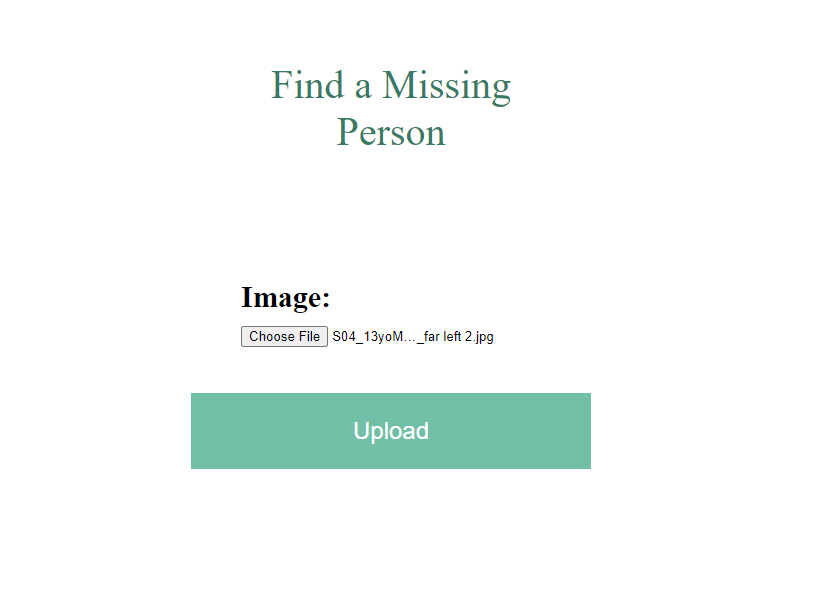

# Lost-Angel-Investigator

Team Members -
<ul>
<li>Harsh Shrirame</li>
<li>Bhavesh Kewalramani</li>
<li>Daksh Kothari</li>
<li>Darshan Jawandhiya</li>
</ul>

In India many children are reported missing every year. Among them large number of cases are never found therefore one of the project's key goals is to create a missing children (people) locate application that may assist ordinary people whose loved ones have been abducted, missed, or rescued by the people. The public can upload photos of missing children, along with landmarks and to our webpage. The photo will be immediately matched to the missing child's registered photos in the database. The supplied child photograph is classified, and the photo with the best match is displayed from the database of missing children. Using the facial image uploaded by the public, a deep learning model is trained to accurately identify the missing child from the missing child image database.

MTCNN, a very successful deep learning method for image-based applications, is employed for face recognition. The EfficientNet is used to recognise faces in photographs. Unlike other deep learning algorithms, our method focuses solely on comparing photographs to those already recorded in the database and producing the most accurate results possible. Using the MTCNN model for face identification with EfficientNet, and correctly training it, yields a deep learning model that is noise, lighting, contrast, and picture position insensitive. The model's training accuracy is 96.66 percent and its validation accuracy is 76.81 percent, implying that there is a approximately 77 percent possibility of finding a match for the missing kid. It was evaluated using 25 Child classes.

***
This model has got 76.81% accuracy on this validation dataset.
***

***
CroppedDataset.zip is zipped file for dataset.

Database of approximately 400 child images collected from internet.
The children in these images ARE NOT ACTUALLY LOST ONES.
Images are used just to train the model on dummy data because we could not get real data of lost children due to security and privacy issues.
***

***
Installation Process
 
1. First clone git repository. 
Write command in cmd  
command - git clone https://github.com/Bhaveshkew/Lost-Angel-Investigator.git

2. Change directory to this folder  
command - cd HackathonWCE   

3. Create a Virtual Environment  
	- pip install virtualenvwrapper-win  
	- mkvirtualenv project

4. Activate the Virtual Environment  
command - workon project  

5. Install Dependencies/Packages  
command - pip install -r requirements.txt  

6. Change directory to folder Frontend (Django)  
command - cd "Frontend (Django)"  

7. Make Migrations and Migrate  
command - python manage.py makemigrations  
command - python manage.py migrate  

8. Run the project  
command - python manage.py runserver  
***

***
Demonstration
Extract the zip file CroppedDataset.zip  

After running the project.   
Go to localhost:8000/print  
 
Upload the image of child from Dataset  

Click Upload  
</img>
See the results.  
</img>
***
